# Basic Class Diagrams
### 1. Class Diagram

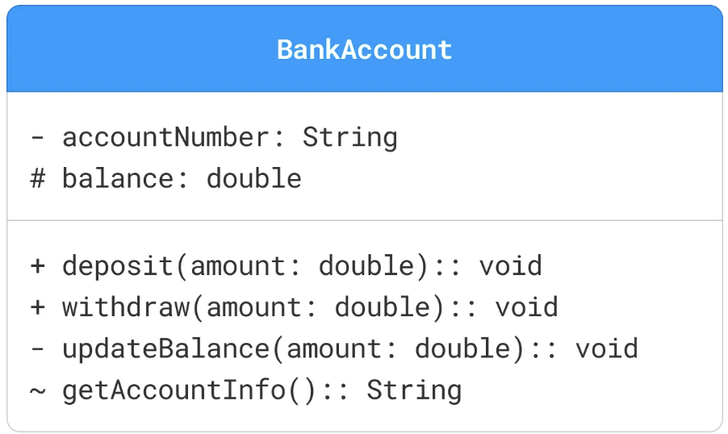

> **Visibility Markers**: Visibility markers indicate the accessibility of attributes and methods within a class.
>- `+` **(Public):** The attribute or method is accessible from any class.
>- `-` **(Private):** The attribute or method is only accessible within the same class.
>- `#` **(Protected):** The attribute or method is accessible within the same class and its subclasses.
>- `~` **(Package):** The attribute or method is accessible within the same package.

### 2. Attributes
```
visibility name: type [multiplicity] = defaultValue
```

 

### 3. Methods
```
visibility name(parameterList): returnType
```

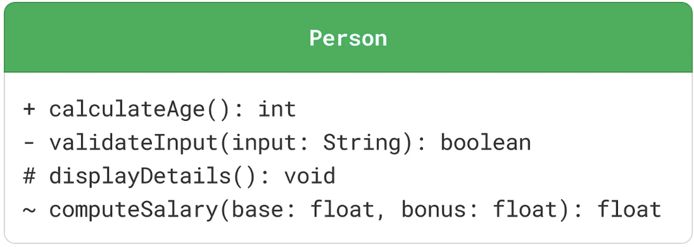

### 4. Interfaces
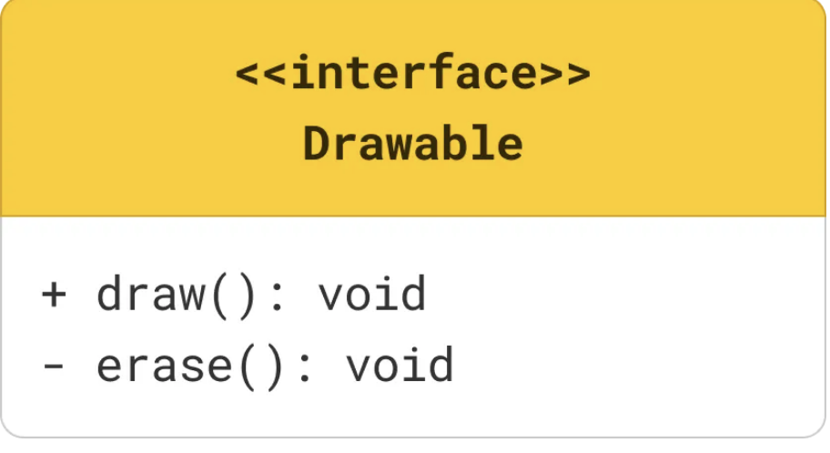

### 5. Abstract Class
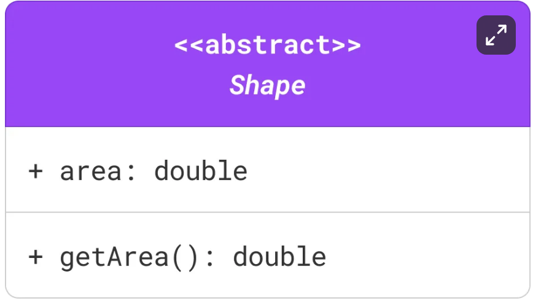


### 6. Enums 
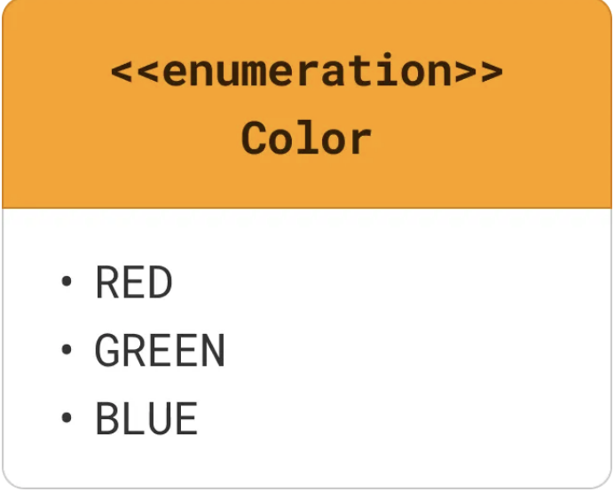
# 2.  Relationships

### 1. Association ($uses-a$)
$-$ "uses-a" relationship between two classes where one class uses or interacts with the other.

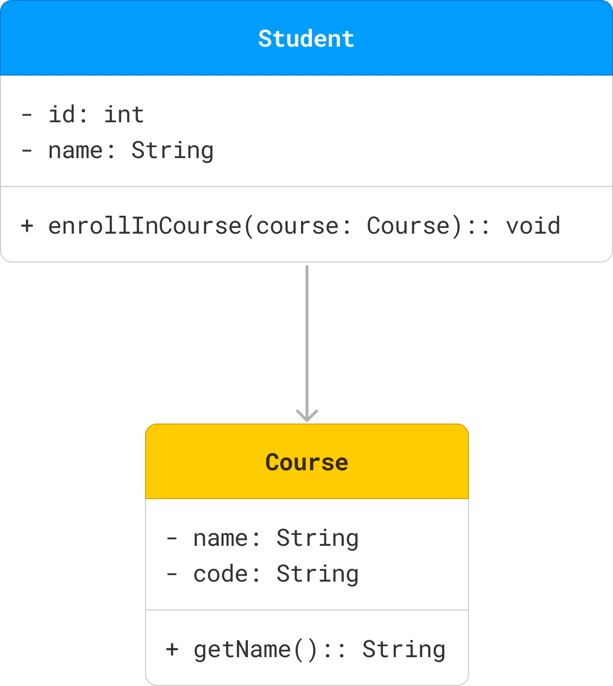

A `Student` class is associated with a `Course` class, as a student can enroll in multiple courses

### 2. Aggregation ($has - a, weak$)

$-$ Aggregation represents a `"has-a"` relationship 
$-$ where one class (the whole) contains another class (the part), but the contained $class\ can\ exist\ independently$.

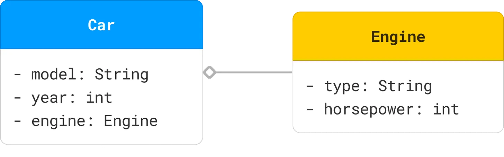
>A `Car` class has an `Engine` class but the Engine class can exist without the Car class.


### 3. Composition( $has - a, strong$)

$-$ Composition represents a **strong** "has-a" relationship where 
$-$ the part cannot exist without the whole. 
$-$ If the whole is destroyed, the parts are also destroyed.

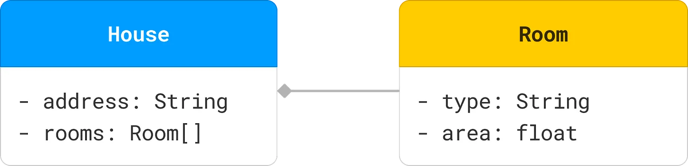
> A `House` class is composed of `Room` class but the Room class can not exist without the House class. 

### 4. Inheritance ($is - a$)
$-$ Inheritance (or Generalization) represents an $is-a$ relationship 
$-$ where one class (subclass) inherits the attributes and methods of another class (superclass).

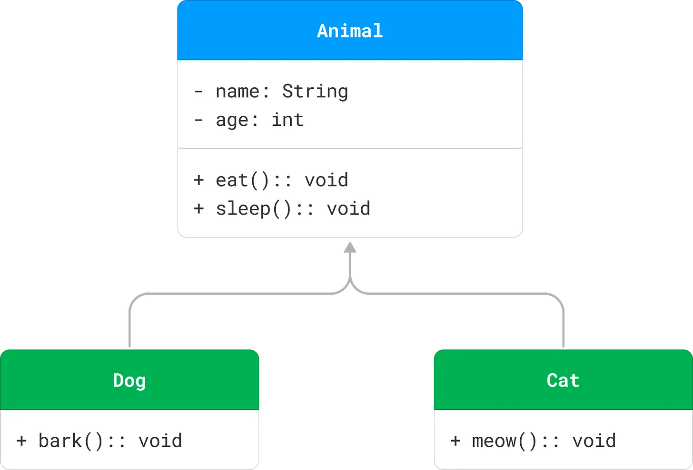
### 5. Realization ( $Implementation$ )
$-$ Realization or implementation represents a relationship between a class and an interface,
$-$ where the class implements the methods declared in the interface.
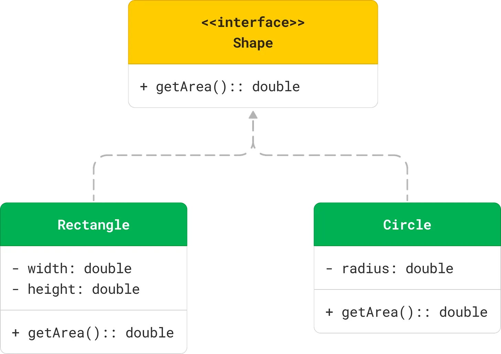

### 6. Dependency ($uses$)
> Dependency represents a uses" relationship where a change in one class (the supplier) may affect the other class (the client).
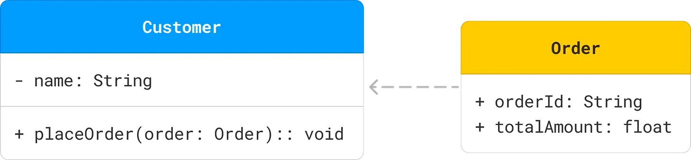

> A `Customer` class uses an `Order` class to place order.

